# QuoteMatch — Module UML & Test Guide

Use this with the interactive canvas in Cursor, or paste Mermaid into any viewer (GitHub, mermaid.live).

Base URL (local): `http://127.0.0.1:8000`

---

## 1. System overview (component)

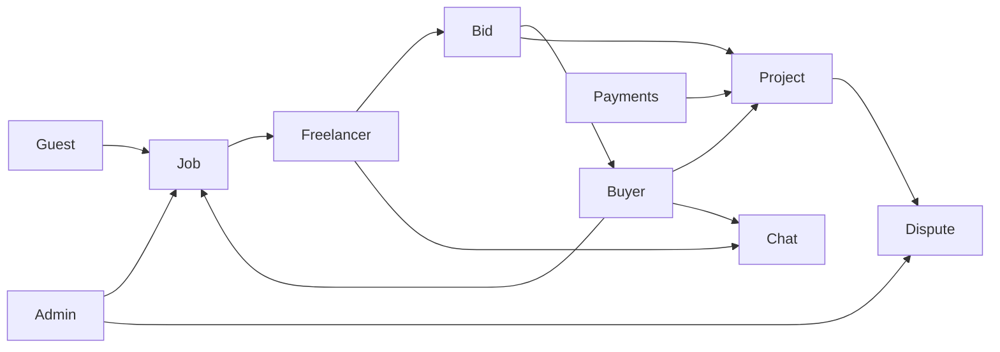

| Prefix | Actor | Route file |
|--------|--------|------------|
| `/` | Public / Guest | `routes/web.php` |
| `/post-job/` | Guest buyer | `routes/web.php` |
| `/buyer/` | Buyer | `routes/buyer.php` |
| `/freelancer/` | Provider | `routes/user.php` |
| `/admin/` | Admin | `routes/admin.php` |
| `/ipn/` | Gateways | `routes/ipn.php` |

---

## 2. Core marketplace flow (activity)

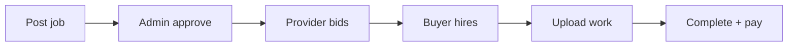

### Entity states to verify

| Entity | States |
|--------|--------|
| Job | Draft → Pending → Approved → Processing |
| Bid | Pending → Shortlisted / Rejected / Withdrawn / Accepted |
| Project | Running → Buyer review → Completed \| Reported |
| Dispute | Open → In review → Resolved |
| TrialTask | Draft → Pending → Accepted → Submitted → Finished |

### Priority E2E order

1. Post → Approve → Bid → Hire → Deliver → Complete  
2. Escrow: deposit → hire → release  
3. Trial task full cycle  
4. Lead credits buy → deduct → block at zero  
5. Project report → admin dispute resolve  
6. Verification upload → admin approve → badge  
7. Dual auth sessions do not mix  
8. Support ticket create → admin reply  

---

## 3. Per-module UML + QA

### Public site

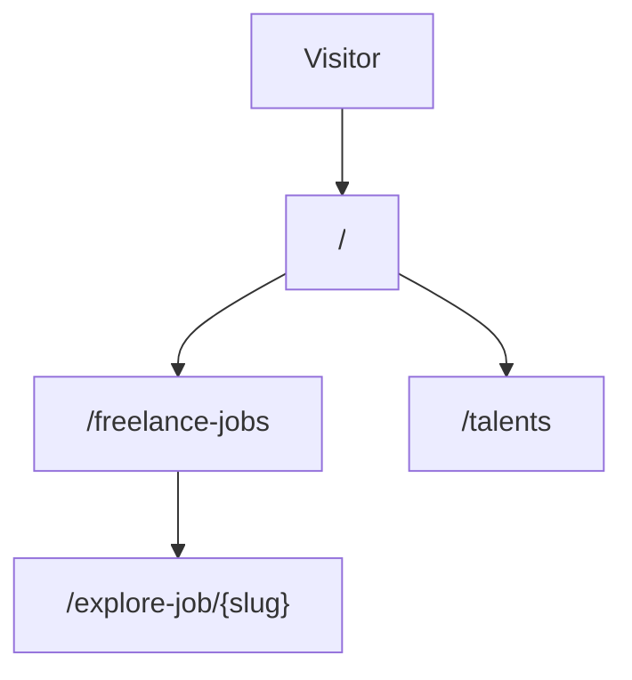

**Test:** home sections; job list/filter; job detail; talents; contact/cookie pages.

---

### Guest job post

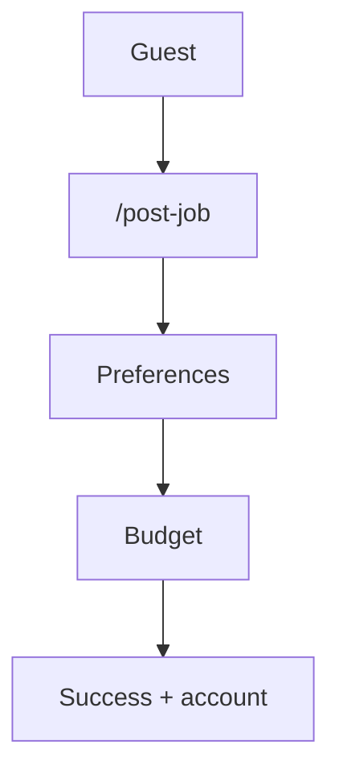

**Test:** logout → Post Job at 0%; category filters skills; unique slug; logged-in buyer redirected to `/buyer/job/post/*`.

---

### Buyer portal

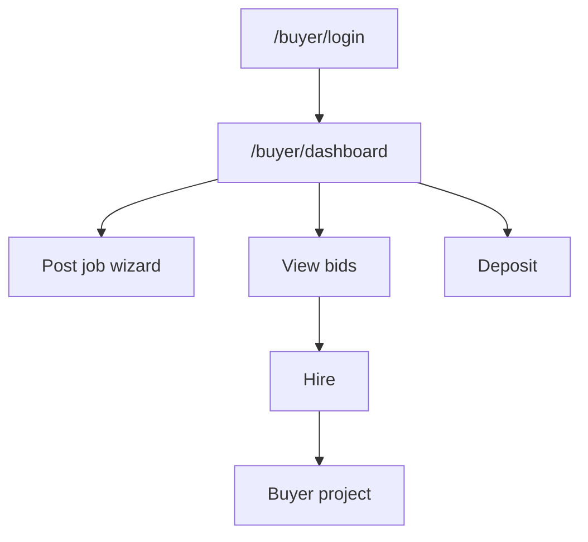

**Test:** wizard (no slug); hire path; deposit; complete project; bid bell notifications.

---

### Freelancer portal

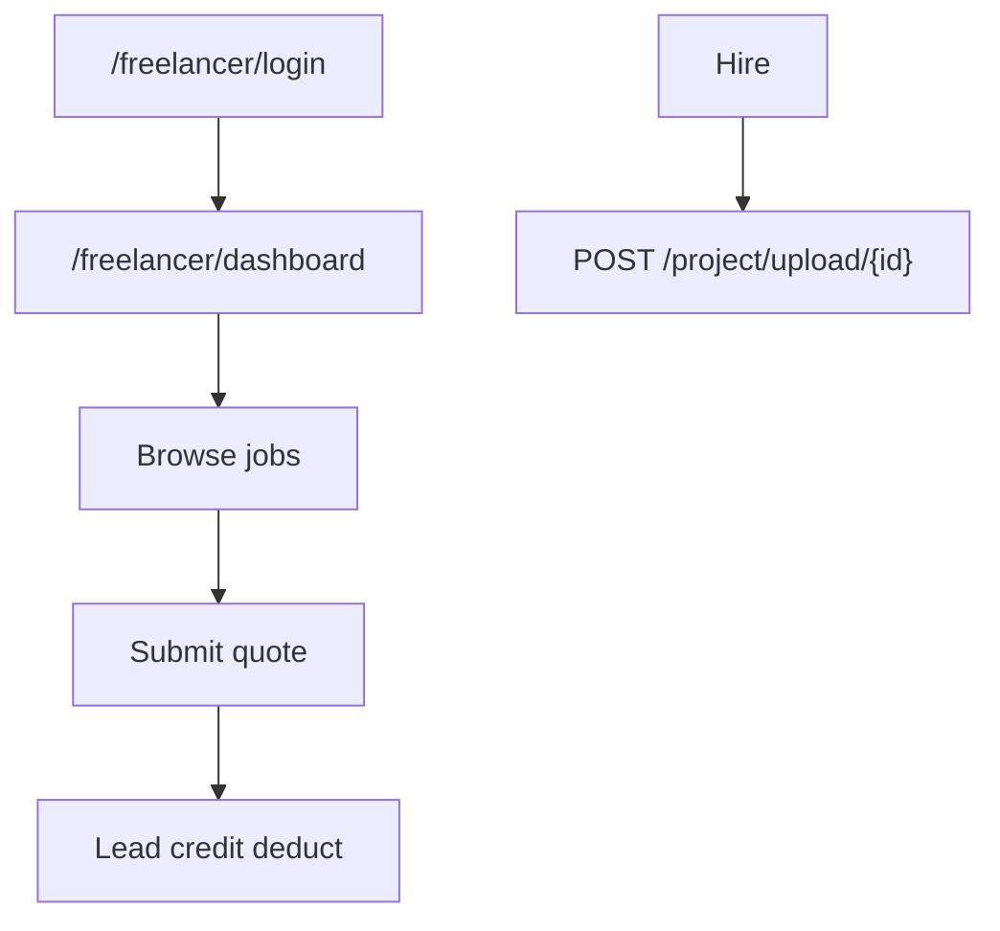

**Test:** approved to bid; credit deduct; upload URL is `upload` not `upload-form`.

---

### Admin panel

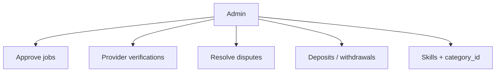

**Test:** pending job approve; verification queue; dispute resolve; skill category binding.

---

### Auth (3 guards)

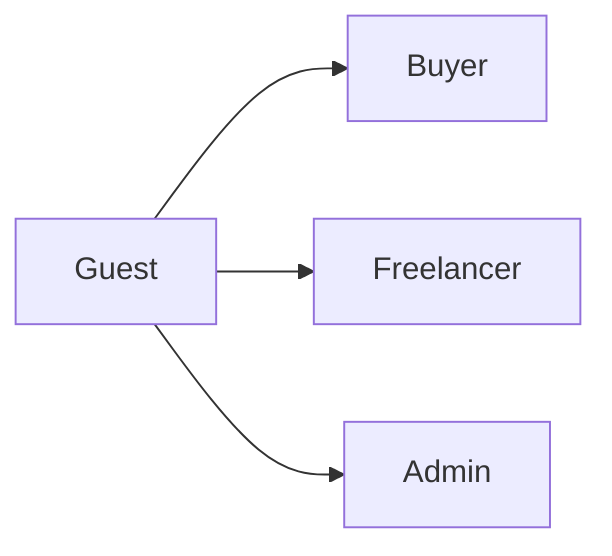

**Test:** register + verify each; sessions do not cross; forgot password each portal.

---

### Payments

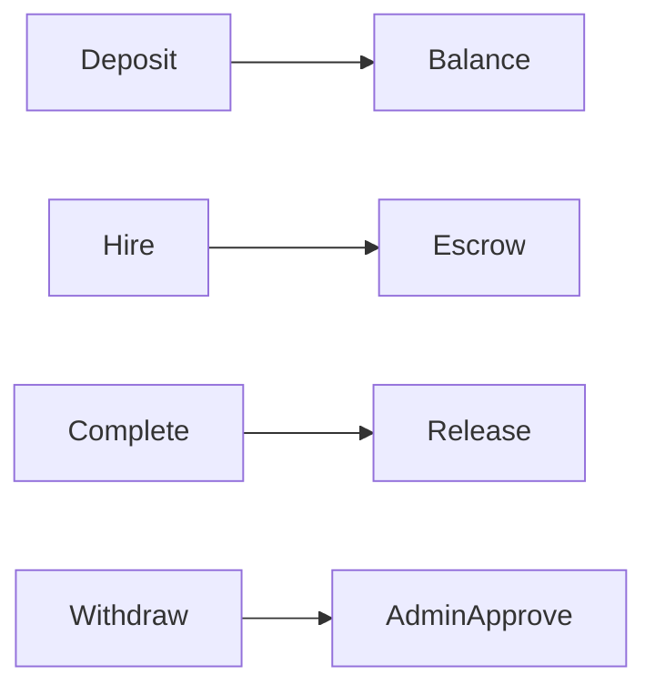

**Test:** deposit balance; hire escrow; complete release; withdraw approval; manual gateway locally.

---

### Chat

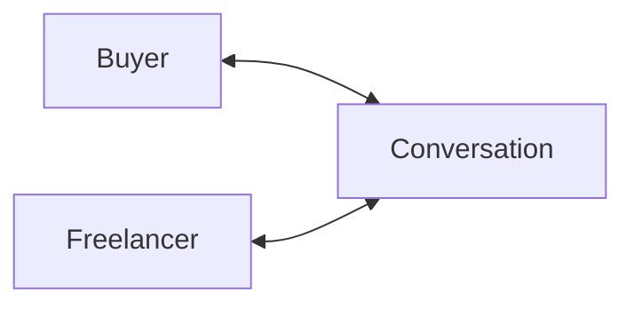

**Test:** open from bids; send both sides; unread badge; toast when not on chat page.

---

### Bids / quotes

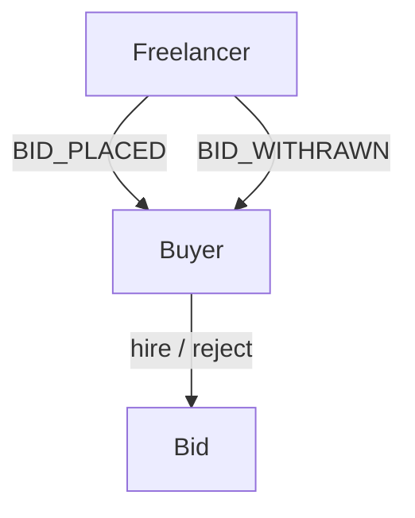

**Test:** place → notify; update within limit; withdraw notify; hire rejects others.

---

### Projects

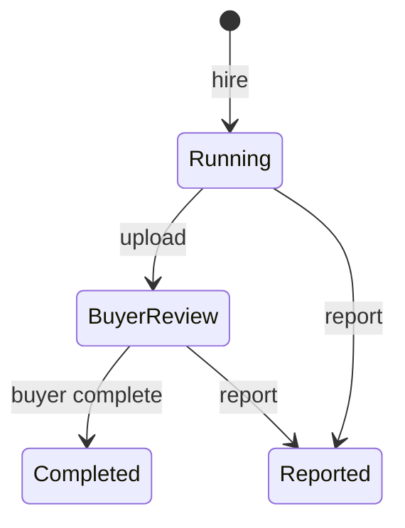

**Test:** RUNNING → upload → BUYER_REVIEW → COMPLETED + pay; report creates dispute.

---

### Disputes

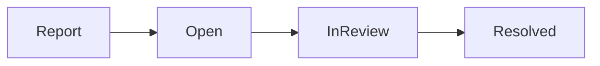

**Test:** report with type/reason; admin in-review → resolve; parties see outcome.

---

### Notifications

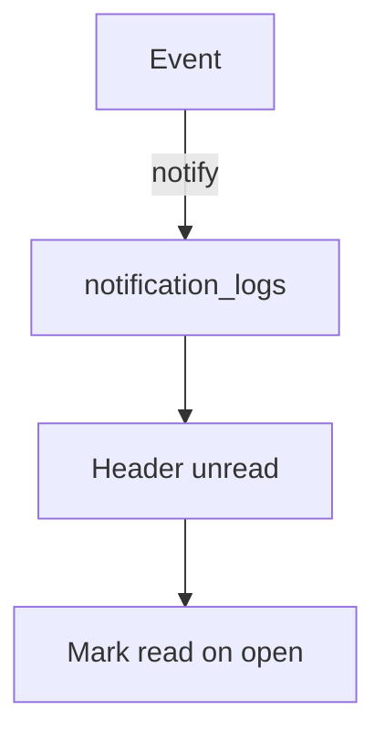

**Test:** new bid badge; mark read; templates; withdraw uses `BID_WITHRAWN`.

---

### Verification badges


**Test:** upload docs; admin approve/reject; badge on public profile.

---

### Lead credits

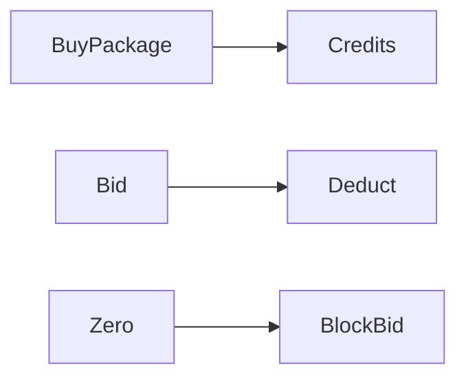

**Test:** enable monetisation; buy package; deduct on bid; zero blocks bid.

---

### Trial tasks

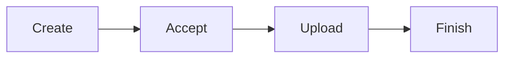

**Test:** create from bid; accept + upload; complete/cancel; admin view.

---

### Support tickets

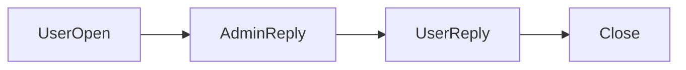

**Test:** open with attachment; admin reply; close.

---

### CMS / frontend

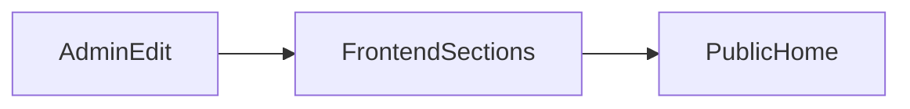

**Test:** edit section → home updates; custom page + SEO.

---

## Smoke URL cheat sheet

```
/
/post-job
/buyer/login
/buyer/dashboard
/buyer/job/post/job-details
/freelancer/login
/freelancer/dashboard
/freelancer/bid/list
/freelancer/project/index
/admin
/admin/jobs/pending
/admin/disputes
/admin/provider-verifications
/admin/monetisation
```
